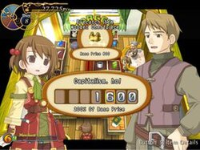
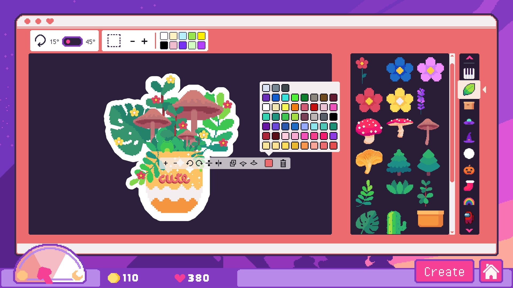
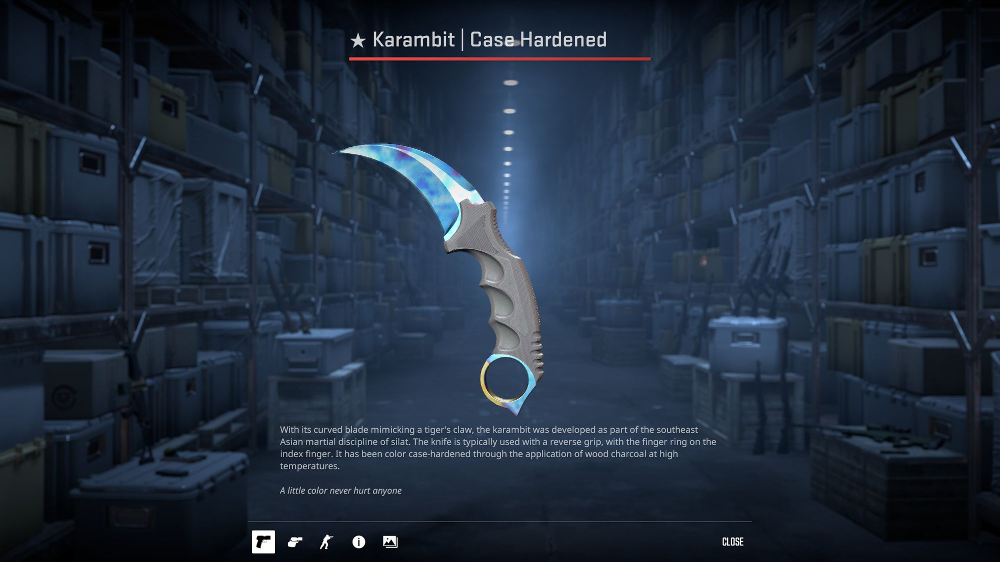
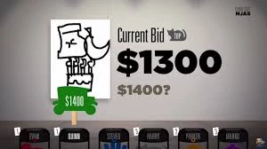

# LudumDare-What-Could-Have-Been

Following the reveal of the theme we began the concepts for a couple of games we wanted to do before settling on the one we ended up on now that the Ludum dare is over i wanted to briefly revisit the other ideas for what i imagined they could have been.

## KPop Card Collector:

This one was 100% the idea i liked the most and it stemmed from a combination of two ideas one was 
1. A nice little game where you create postcards and collect holographic stickers and stamps to sell at a store.
2. A game where you stalk a kpop idol and take pictures of them without them noticing 

After coming up with these two ideas we ended up creating a fusion of them where you would open a bizarre store that sold collectible cards of kpop idols. The idea was there would be crazy whacky customers that rolled up to your store and you could decorate cards that you got from booster packs with stickers, markers, photo filters, and whatever else. 

Each customer would enjoy something a little different and ultimately you would barter with them to get the best sales or trades. 

We didn't get deep into the details because we later determined the game to be out of scope for a little game jam (which im glad we did because we barely finished our much lower scope game in time) If i were to expand more on the game systems and inspirations now that i have the time to i would probably name three primary games or game genres

1. Shop Games: Recettear, Passpaurtou, Papa’s games
2. Decoration Games: Cosmic wheel sisterhood, Sticky business 
3. Collectible card games: Pokemon, Yugioh, Etc

In terms of how the game would actually function, here are the mechanics I think I would “steal” from these games. 

1.  One of my favorite game shop management games ever, Reccettear's barter system is easily the thing that I would bring from it. From haggling down your customers who want to sell something to you to giving a ridiculous price and getting that bag, I love the shop system in this game. I think a big part of it is how they give every character a budget and some specific habits for example sometimes you would get this child character who comes in and if nothing in your shop matches their budget, well your not going to end up selling anything i think it adds a lot of depth to the interactions as well as the characters that you get to meet.

2. A huge part of this game takes inspiration from photobooths. The game that fits our decoration mechanic the most for sure is Sticky Business although the cosmic wheel sisterhood comes close behind. I love the way that these games make creating something beautiful simple and remove any barrier of entry to making something nice which i think is great. Sometimes expressing yourself is something people don't often get to do and i think is really valuable and nice to come down from hyper competitive or stressful games that people often enjoy playing

3. This is the final thing but it's actually not a mechanic in any game that i know of currently the mechanic i would take is actually from real life grading companies like PSA and TAG this would be the concepts of card centering, defects, and other minor differences that can make a sort of “jackpot” effect taking from this vein in can't help but mention CS:GO with their “Blue Gems” and other crazy skin mechanics just by adding a variable in the shader to move the uv or change certain values it completely changes the perception when opening packs. That question always stands: is this card worth its weight in gold? Or is it worth less than the cardboard it's printed on?

## Auctioneer:

Auctioneer is a game about collecting sets of items to make even more money! Similar to the previous game where customers barter with you to get a good deal, this time it's reversed and you must go to the auction and bid on items that will fit your collection. More items in the same collection means more money but watch out for clever fakes and fabrications. This game would be relatively simple mainly just a combination of the abstraction of money/value making it hard for you to know if it's worth going over the value of an object and luck being whether or not the object is easy to fake and if you can actually tell from the item catalog which we would provide to you.

The ultimate end goal would be to collect as much money as possible for a Luigi's mansion style end game where it showcases how well you have done. Although we ultimately chose another game, I think this game would have been pretty fun as well!

I think the primary inspiration would be the jackbox game called bidiots where you largely do something similar but in a more multiplayer sort of social deduction sort of game instead overall i think its a pretty fun idea and id love to see a game like this someday.

## Dripfindr:

Dripfinder is a game where you play as a gig worker on an app called “dripfindr” . It's a service similar to ubereats or doordash where you must find clothing that matches the description shown on the app and deliver it to the recipient. The game would combine an element of speed, thrifting, and budgeting while you explore the mall environment. Ultimately we decided against this game because of the idea of the large mall but in hindsight i realized hey we probably could make this game if we simply made storefronts and had UI bring you from store to store instead ultimately it would still lack the exploration aspect but I feel the ideas of finding fashion and meeting customer demands were pretty novel and had potential. 

I think the core idea is a sort of single player “dress to impress” style game where you have to come up with the best of what you can do in a short amount of time. 

Anyways this is all for this game jam most of these games never came to be but i really hope we can do something fun for the next one! It's always fun to think about the past but overall I'm pretty happy with the game I ended up with. I hope you all try out doomsday sales and see what it's like!
