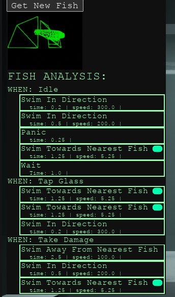
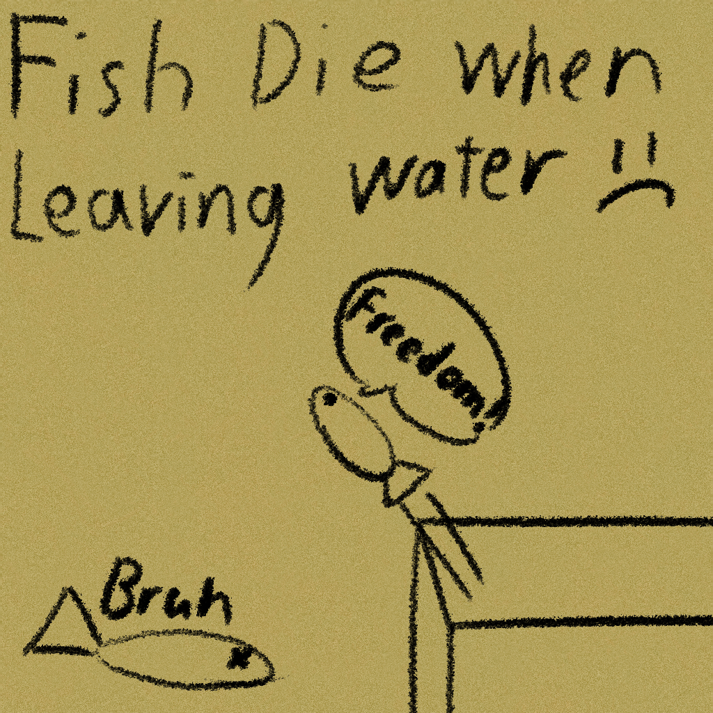
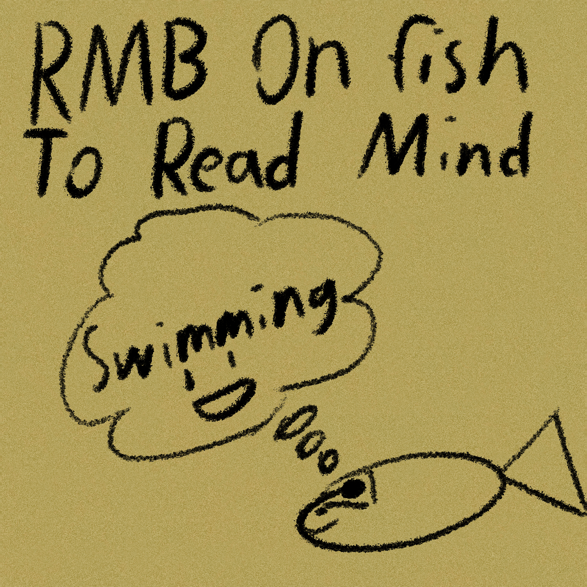
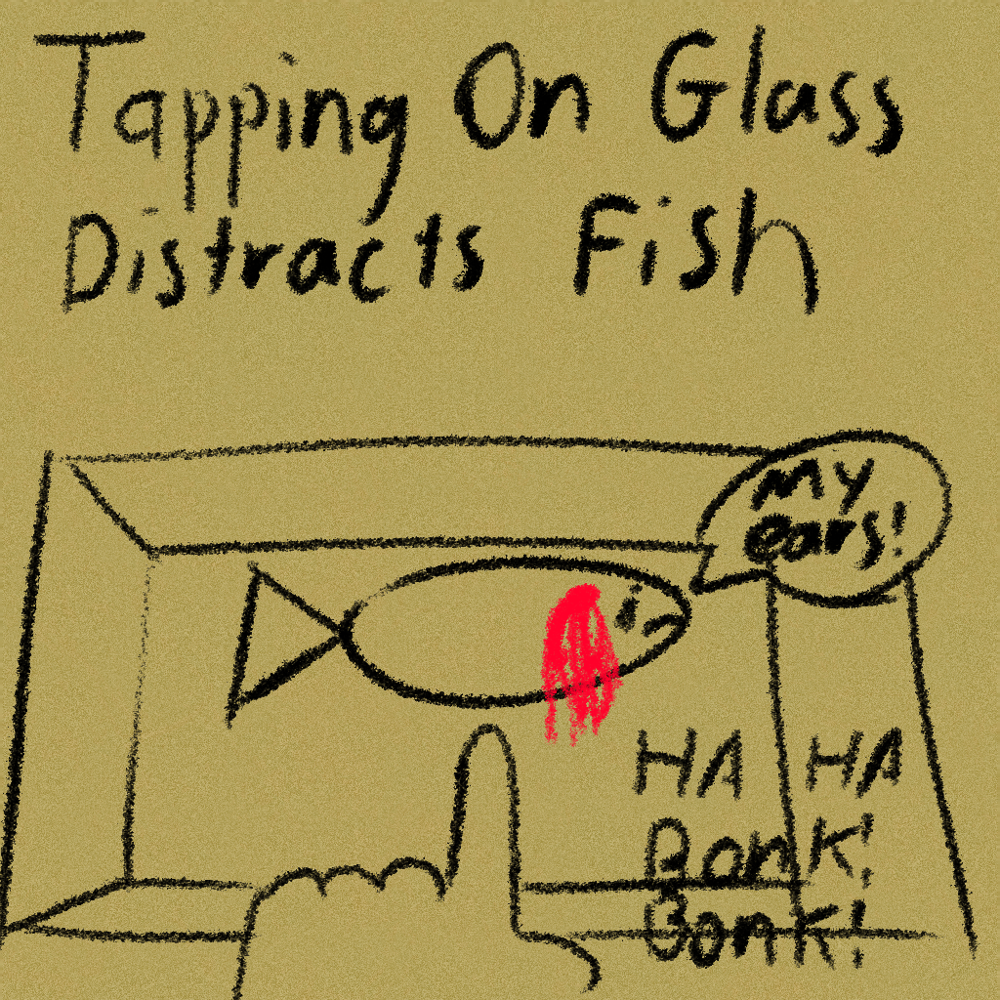
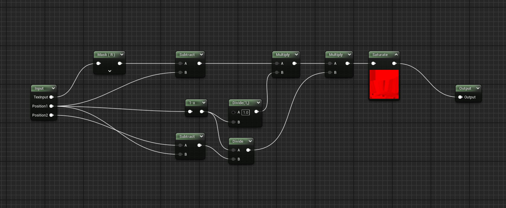
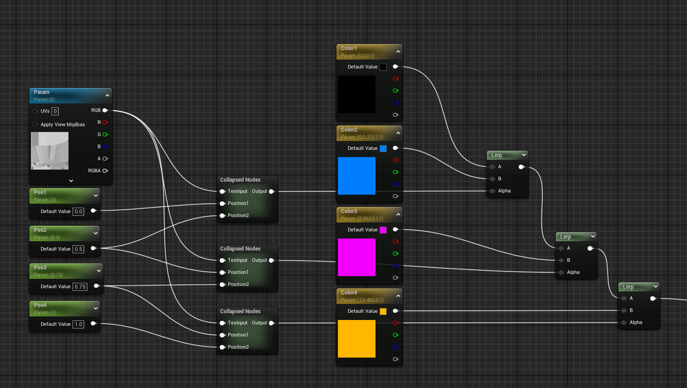
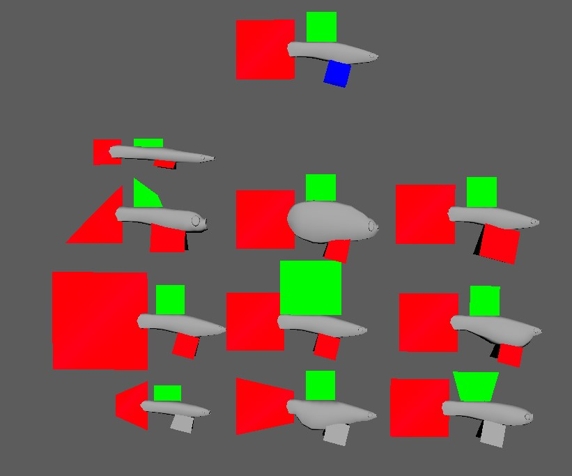

## FISH FIGHTING RING

A Fish Based Game is an arena autobattler where you catch and breed the ultimate fish to defeat your rivals. 

We made this game for Ludum Dare 56 as a team of two and it was my first time as an artist in unreal engine. We ended up only having 2 days to work on the game due to having work during its creation but I think we ended up making a pretty unique game. I ended up creating the “blendfishes” and rig, as well as the “levels” for the game. I really wanted to insert a little bit of that child-like wonder into it inspired a little by pokemon. 

## What i worked on (Design)

For this game jam I mainly worked on just art and design with all the programming being done by my partner for the project Quinton. 

I wanted to include a figma board for our original ideas on how the fishes would work as well as different behaviors but it seems that it's lost to time. I wanted the fish to be able to have a few specific behaviors that would trigger upon some specific scenarios. 

You can see they are when idle, take damage, and tap glass. There are then 5 different actions with randomized values that also generated alongside each fish these were originally: "swim away from fish", "swim towards fish", "move in direction", and "stop" which was later instead replaced with "panic"

Originally when testing the games each trait of the fish had the same probability of appearing which was later changed. We also later realized that idle was actually super lame and we ended up making that appear the least before removing it completely and replacing it with one of my favorite behaviors: panic. ‘

When combined with the breeding mechanic which would add the behaviors of one fish to another and some of the stats as well you can quickly see some very interesting emergent behaviors start occurring. 

You can see some of the goofy sticky notes I made as tutorials in the game and they serve as a simple way for players to quickly get what's going on. 

{: style="width: 300px; height: auto; margin: .5rem;"}
{: style="width: 300px; height: auto; margin: .5rem;"}
{: style="width: 300px; height: auto; margin: .5rem;"} 
{: style="width: 300px; height: auto margin: .5rem;"}

In terms of gameplay these simple rules were effective making many different varieties of playable fish creatures. Later on the system was also used to make the boss encounters in the post preview gif you can see Sarah "the cheater" who has two fishes that circle the tank. Below you can see Brian "the nerd" who has a fish that mostly panics until its hit before trying to strike back at the player.

In another world all the fishes would be custom and built more specifically but ultimately we decided due to time constraints that wasn't really feasible especially with the additional emphasis on "unique fishes" instead we just added a claw machine area where you could catch fish to add to your tank to use and breed.

Overall this was a fun design to work on although a little rough around the edges in hindsight. I think we made many tuning changes and tweaks to get things just right. One thing i will say i learned alot was to let things ride until its finished before making those smaller adjustments as its more important to get rid of major bugs before smaller incremental improvements that can get overwritten by a change in behavior or design.

### What i worked on (Art)

A Fish Based Game had some pretty cool tech art features that we were able to do involving the fish and the variety of possible fish you could end up making. The result is a game where there is essentially an infinite number of possible fish you could create. Here are the major features that I worked on for the game and a little more on them. 

1. Procedural Swimming Animations

Using a simple rig and some unreal engine nodes and variables like speed we were able to make some convincing swimming animations without much time at all! I think the animations ended up being fairly organic and smooth overall. We ended up learning lots and making it work. 

2. Use Of Gradient Mapping For Fish Colors 

 

Here you can see the material shader and the way I made a simple grad map for unreal. In unity they have an entire node for it but in unreal it seemed like there isn't a pre built node regardless i made it work. here the fish texture that we ended up using. 

Overall there was a lot that I learned here and in the future I would do my gradmapping very differently and not at all like the way I did it here. Big takeaways are using more dark and light colors to widen the range and thinking more carefully about where different colors blend overall. It was a very solid application of a technique that I hadn't used much before.

3. Different Blendshapes For The Fish Model

We used different blendshapes for the fish model that resulted in many many different fish designs. When a fish is generated the value of them would also be random while when breeding fish these would be combined between the two. Overall although i am happy that the fish designs end up being represented in the final random fishes i think a few big things i learned were:

1. The blendshapes end up fractional requiring more exaggerated shape
2. The averaging of multiple blendshapes ends up reducing the uniqueness of each individual shape 

