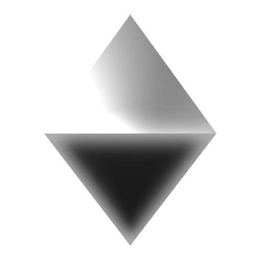
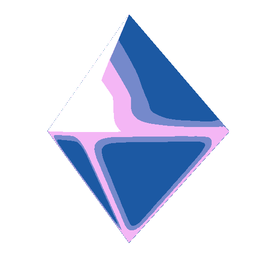

## SPRITEBAKER9000: 3D TO PIXEL ART

The SpriteBaker9000 is a tool in Blender to automate the process of converting 3D models into consistent, pixel perfect 2D sprites. It's a comprehensive rendering pipeline, combining Python scripting, compositing nodes, and material setups to transform 3D models into 2D game assets.

The goal of this project was to create a simple to use system where an artist can import a mesh and bake sprites the way they want and are comfortable with. As an artist myself I have many skills that make certain processes easy (material shaders, compositing, vfx, scripting) while other processes are quite difficult for me (drawing, 2D pixel art, hand rendering). For many other people this is reversed so the goal is a system where you can work the way you want to personally without worrying about an exact series of actions. 

## The Pipeline 

The core of the tool relies on a multi-stage compositing process that cleans and downscales the 3D render into a pixel-perfect format. Much of the logic here is provided by [lospec blender-toolkit](https://lospec.com/blender-toolkit/) and [Astropulse](https://astropulse.itch.io/blender-to-pixels) in fact you can consider this whole project to largely be a fork of astropulses project. However I have made some minor changes to the compositing pipeline especially at the end when the outline is added. Here are the basics of how this works. 

1. Render Cleaning: The initial Cycles render is processed to remove unwanted transparent pixel artifacts, ensuring sharp edges before downscaling.

{: width="400" }

2. Posterization: Using the custom "8Mat Dither Combiner" node (This is from the lospec blender tool kit) the render is posterized into 8 tuneable colors, functioning similarly to a gradient map you can skip this process by setting the material index in blender to any number outside 1-8 this is so people who want something different can just use material shaders or textures to drive their sprite bake.

{: width="400" }

3. Downscaling: The final image is downscaled to specific resolutions (e.g., 16x16px or 64x64px) using a scale node in the compositing tree you may set this to whatever resolution or size needed.

{: width="400" } {: width="400" }

4. Outline: after that an optional outline is added. there was an original outline node before i came along but i didnt like it so i made my own.

{: width="400" } {: width="400" }

## My major contributions 

Before I stated that this system is a fork of another system so one might ask what I added specifically, other than reworking how outlines are done in the compositor and creating documentation for people who might not be as familiar with the blender rendering and compositing pipeline I also did a few key things designed to smooth things down from artist to tool.

1. Custom Lighting Setups: 
To ensure ease of use and that the 3D models don't look "flat" when converted, I included preset light setups that helps with the more download and bake sort of feel I want people to have when using the tool. Even if your exact setup isn't included, a quick adjustment from the set examples should be enough to get you started at the minimum. 

2. Shaders Examples:
I made some shader examples for both people who want to use the 8MatDither or ignore it completely. Basic effects like edge highlighting and adjustment as well as some things like toon shaders or effects. This is both for people who aren't familiar with shaders as well as those who are to showcase some simple use cases 

3. Python automation and tools:
This is the bulk of the work. The first thing I made was a turn table renderer but that slowly bloomed into a larger set of tools. At the current moment you are able to render out sprites automatically, set the amount of frames that animation should be. Adjust offsets and any other slight animations you want to play. Automatically combine that sprite sheet into a row of sprites and finally combine those rows into a big sheet if you would like that for any purposes. 

## Lessons Learned & Future Iterations

Working with this tool highlighted several challenges in the 3D-to-2D workflow mostly stemming from differences between multiple people who might want to use the tool for vastly different things. 

A professional pixel artist looking to render a 3d example for them to map either lighting or shapes onto wants something entirely different from 3D only artists who want to focus on modeling and textures and so i tried to make several work flows that would work for not just these two kinds of artists but any other kind of artist who might want to make 3D art into 2D. 

Overall theres alot of things you can end up doing with these rendered spritesheets to end off heres an example for an upcoming game im working on!

